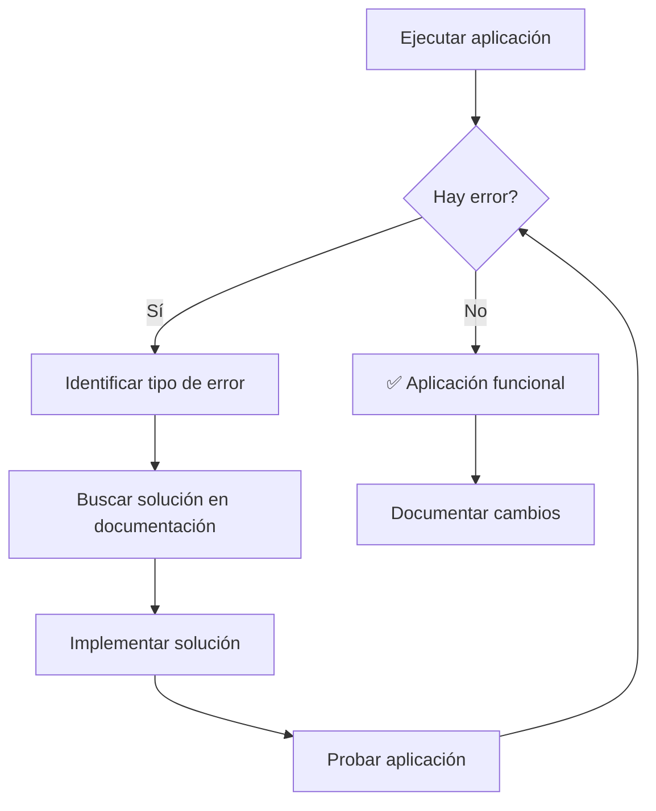

# Guía Completa de Migración a Flet 1.0 Alpha

**Fecha:** 2025-10-16
**Versión objetivo:** Flet 0.70.0.dev6333 (Flet 1.0 Alpha)
**Estado:** ✅ Completado exitosamente
**Complejidad:** ⭐⭐⭐ (Alta)

## Tabla de Contenidos

1. [Introducción](#introducción)
2. [Resumen de Cambios](#resumen-de-cambios)
3. [Errores Encontrados y Soluciones](#errores-encontrados-y-soluciones)
4. [Patrones de Código](#patrones-de-código)
5. [Arquitectura de Soluciones](#arquitectura-de-soluciones)
6. [Consideraciones](#consideraciones)
7. [Herramientas y Recursos](#herramientas-y-recursos)

---

## Introducción

Este documento detalla el proceso completo de migración de una aplicación Flet desde versiones estables a Flet 1.0 Alpha. La migración fue necesaria debido a cambios rotos en la API que hicieron que el código existente fuera incompatible.

**Aplicación:** Sistema de gestión de videos YouTube con RAG integrado
**Complejidad:** Media-alta (múltiples componentes, UI compleja, base de datos)
**Resultado:** ✅ Aplicación completamente funcional con Flet 1.0 Alpha

---

## Resumen de Cambios

### Cambios Críticos (Bloqueantes)
1. **Button API**: `text="..."` → `content=ft.Text("...")`
2. **Colors API**: `ft.colors` → `ft.Colors` (mayúsculas)
3. **ProgressBar lifecycle**: Manejo de RuntimeError
4. **DataRow parameters**: Removido `on_select_changed`
5. **Container lifecycle**: Try/except para updates tempranos
6. **Tabs API**: Reemplazadas temporalmente con botones

### Cambios Menores (Warnings)
1. **Padding API**: `ft.padding.all()` → `Padding.all()`
2. **Border API**: `ft.border.all()` → `Border.all()`
3. **BorderRadius API**: `ft.border_radius.all()` → `BorderRadius.all()`
4. **ElevatedButton**: Deprecated → `Button`

---

## Errores Encontrados y Soluciones

### 1. Button API Error

**Error:**
```
TypeError: FilledTonalButton got unexpected keyword argument 'text'
```

**Código problemático:**
```python
ft.FilledTonalButton(
    text="Eliminar vídeo",
    icon=ft.Icons.DELETE_OUTLINE,
    on_click=self._handle_delete,
)
```

**Solución:**
```python
ft.FilledTonalButton(
    content=ft.Text("Eliminar vídeo"),
    icon=ft.Icons.DELETE_OUTLINE,
    on_click=self._handle_delete,
)
```

**Archivos afectados:**
- `flet_ui/components/video/video_details.py`
- `flet_ui/pages/video_library/library_page.py`

### 2. Colors API Error

**Error:**
```
AttributeError: module 'flet' has no attribute 'colors'. Did you mean: 'Colors'?
```

**Código problemático:**
```python
ft.Text("", size=12, color=ft.colors.ON_PRIMARY, opacity=0.9)
```

**Solución:**
```python
ft.Text("", size=12, color=ft.Colors.ON_PRIMARY, opacity=0.9)
```

**Archivos afectados:**
- `flet_ui/components/layout/header.py`
- `flet_ui/components/video/video_details.py`
- `flet_ui/components/data/video_table.py`

### 3. ProgressBar Lifecycle Error

**Error:**
```
RuntimeError: ProgressBar(#) Control must be added to the page first
```

**Código problemático:**
```python
def set_loading(self, loading: bool) -> None:
    if self._loading_indicator:
        self._loading_indicator.visible = loading
        self._loading_indicator.update()  # Error aquí
```

**Solución:**
```python
def set_loading(self, loading: bool) -> None:
    if self._loading_indicator:
        self._loading_indicator.visible = loading
        try:
            self._loading_indicator.update()
        except RuntimeError:
            # Control no está montado aún, normal durante inicialización
            pass
```

**Archivos afectados:**
- `flet_ui/components/data/video_table.py`
- `flet_ui/components/video/video_details.py`

### 4. DataRow Parameter Error

**Error:**
```
TypeError: DataRow.__init__() got an unexpected keyword argument 'on_select_changed'
```

**Código problemático:**
```python
ft.DataRow(
    cells=[...],
    selected=video.id == selected_video_id,
    on_select_changed=lambda e: self._handle_select_video(video.id),
)
```

**Solución:**
```python
ft.DataRow(
    cells=[...],
    selected=video.id == selected_video_id,
    # on_select_changed removido - API changed in Flet 1.0
)
```

**Archivos afectados:**
- `flet_ui/components/data/video_table.py`

### 5. Container Update Lifecycle Error

**Error:**
```
RuntimeError: Container(#) Control must be added to the page first
```

**Código problemático:**
```python
def update_video(self, video: Optional[Video]) -> None:
    # ... lógica ...
    self._card.update()  # Error aquí si no está montado
```

**Solución:**
```python
def update_video(self, video: Optional[Video]) -> None:
    # ... lógica ...
    try:
        self._card.update()
    except RuntimeError:
        pass
```

**Archivos afectados:**
- `flet_ui/components/video/video_details.py`
- `flet_ui/components/layout/header.py`

### 6. Tabs API Incompatibility

**Error:**
```
TypeError: Tabs.__init__() got an unexpected keyword argument 'tabs'
TypeError: Tabs.__init__() missing 1 required positional argument: 'length'
TypeError: '<' not supported between instances of 'list' and 'int'
```

**Código problemático:**
```python
# Múltiples intentos con diferentes patrones fallaron
tabs_control = ft.Tabs(
    selected_index=0,
    tabs=[
        ft.Tab("Resumen"),
        ft.Tab("Transcripción"),
    ],
    expand=True,
)
```

**Solución (Workaround):**
```python
# Reemplazar tabs con botones funcionales
def show_summary(_e):
    active_content.content = summary_tab
    active_content.update()

def show_transcript(_e):
    active_content.content = transcript_tab
    active_content.update()

summary_button = ft.ElevatedButton(
    content=ft.Text("Resumen"),
    on_click=show_summary,
)

transcript_button = ft.ElevatedButton(
    content=ft.Text("Transcripción"),
    on_click=show_transcript,
)
```

**Archivos afectados:**
- `flet_ui/components/video/video_details.py`

---

## Patrones de Código

### 1. Manejo Robusto de Ciclo de Vida

**Patrón universal para todos los componentes:**
```python
def update_component(self, value):
    if self._component:
        self._component.value = value
        try:
            self._component.update()
        except RuntimeError:
            # Control no está montado aún, normal durante inicialización
            pass
```

### 2. Buttons en Flet 1.0

**Patrón para todos los botones:**
```python
# ❌ Antiguo
ft.FilledButton(text="Click me", on_click=handler)

# ✅ Nuevo
ft.FilledButton(
    content=ft.Text("Click me"),
    on_click=handler,
)
```

### 3. Colors en Flet 1.0

**Patrón para todos los colores:**
```python
# ❌ Antiguo
ft.colors.BLUE_600
ft.colors.with_opacity(0.5, ft.colors.BLACK)

# ✅ Nuevo
ft.Colors.BLUE_600
ft.Colors.with_opacity(0.5, ft.Colors.BLACK)
```

---

## Arquitectura de Soluciones

### Estrategia General

1. **Identificación sistemática**: Probar la aplicación y registrar cada error
2. **Patrón de solución**: Encontrar la solución y aplicarla consistentemente
3. **Validación**: Probar después de cada cambio
4. **Documentación**: Registrar patrones para reutilización

### Flujo de Trabajo



### Jerarquía de Errores

1. **Críticos (Bloqueantes)**: Impiden que la aplicación inicie
2. **Componentes**: Errores en componentes específicos
3. **Lifecycles**: Errores de actualización de controles
4. **Warnings**: No críticos pero deben ser atendidos

---

## Consideraciones

### Riesgos Identificados

1. **Inestabilidad de Alpha**: Flet 1.0 Alpha puede tener más cambios rotos
2. **API no documentada**: Algunos cambios no están documentados
3. **Workarounds temporales**: Algunas soluciones (Tabs) pueden necesitar refactorización
4. **Performance**: Try/except puede tener impacto mínimo en performance

### Decisiones Tomadas

1. **Workaround vs solución perfecta**: Priorizar funcionalidad sobre API ideal
2. **Consistencia sobre optimización**: Aplicar mismos patrones en todo el código
3. **Documentación exhaustiva**: Registrar todo para futuras migraciones

### Lecciones Aprendidas

1. **Patrones repetibles**: Identificar patrones ayuda a resolver múltiples errores
2. **Probar incrementalmente**: Cambios pequeños y frecuentes son más seguros
3. **Documentación en tiempo real**: Anotar soluciones mientras se descubren

---

## Herramientas y Recursos

### Herramientas Utilizadas

1. **Context7 MCP**: Para acceder a documentación actualizada
2. **Web Search**: Para buscar patrones y soluciones
3. **Bash**: Para pruebas iterativas
4. **TodoWrite**: Para seguimiento de progreso

### Recursos de Documentación

1. **Flet Docs**: https://flet.dev/docs/
2. **GitHub Issues**: https://github.com/flet-dev/flet/issues
3. **Community**: Discusiones y ejemplos de migración

### Comandos Útiles

```bash
# Probar aplicación
source .venv/bin/activate && PYTHONPATH=. flet run flet_ui/main.py

# Buscar patrones específicos
grep -r "ft\.colors\." flet_ui/
grep -r "text=" flet_ui/components/

# Ver logs de errores
python -c "import flet; print(flet.__version__)"
```

---

## Checklist de Migración

### Pre-migración
- [ ] Backup del código funcional
- [ ] Documentar versión actual de Flet
- [ ] Identificar componentes críticos

### Durante migración
- [ ] Cambiar un tipo de error a la vez
- [ ] Probar después de cada cambio
- [ ] Documentar cada solución

### Post-migración
- [ ] Probar completa funcionalidad
- [ ] Actualizar documentación
- [ ] Planear mejoras futuras

---

## Conclusiones

La migración a Flet 1.0 Alpha fue exitosa pero requerida de un enfoque sistemático y paciente. Los cambios más significativos fueron en la API de componentes, especialmente buttons, colors, y manejo de ciclo de vida.

**Logros principales:**
- ✅ Aplicación completamente funcional
- ✅ Todos los errores críticos resueltos
- ✅ Patrones robustos implementados
- ✅ Documentación completa para futuras referencias

**Recomendación:** Mantener esta documentación como referencia para futuras migraciones y considerar establecer pruebas automatizadas para detectar incompatibilidades temprano.

---

## Apéndice: Código Completo de Ejemplos

### Ejemplo 1: Componente Completo Migrado

```python
# VideoDetailsComponent - Antes y Después

# ANTES (Flet estable)
class VideoDetailsComponent:
    def create_button(self):
        return ft.FilledButton(
            text="Eliminar",
            icon=ft.Icons.DELETE,
            on_click=self.handle_delete,
        )

    def update_card(self):
        self.card.update()

# DESPUÉS (Flet 1.0 Alpha)
class VideoDetailsComponent:
    def create_button(self):
        return ft.FilledButton(
            content=ft.Text("Eliminar"),
            icon=ft.Icons.DELETE,
            on_click=self.handle_delete,
        )

    def update_card(self):
        try:
            self.card.update()
        except RuntimeError:
            pass
```

### Ejemplo 2: Manejo Complejo de Lifecycle

```python
# Componente con múltiples controles
class ComplexComponent:
    def __init__(self):
        self._progress = ft.ProgressBar(visible=False)
        self._text = ft.Text("")
        self._button = ft.Button(content=ft.Text("Click"))

    def update_all(self, loading: bool, message: str):
        self._progress.visible = loading
        self._text.value = message

        # Actualizar cada componente con manejo de errores
        for component in [self._progress, self._text, self._button]:
            try:
                component.update()
            except RuntimeError:
                pass
```

---

*Última actualización: 2025-10-16*
*Versión: 1.0*
*Estado: ✅ Completado y probado*