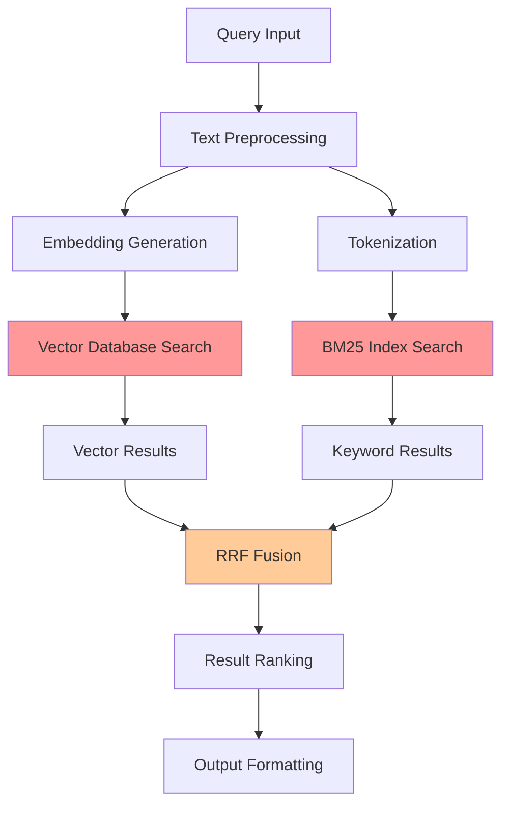
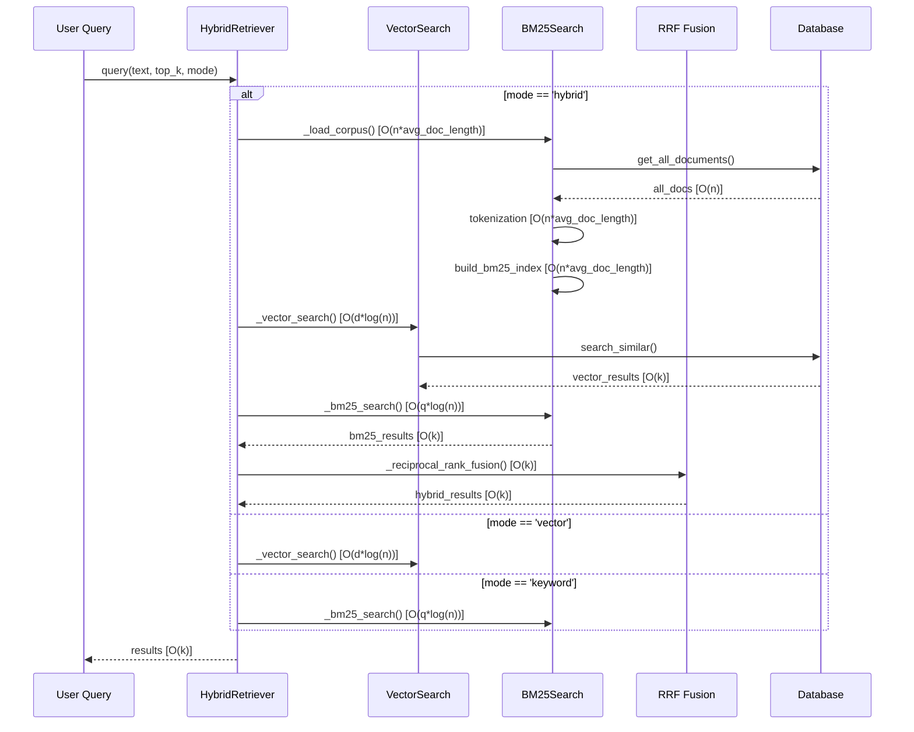

# Complexity Analysis: Hybrid RAG Retrieval System

## 1. Executive Summary

This document provides a comprehensive analysis of the complexity inherent in the hybrid RAG system. Understanding complexity is crucial for identifying bottlenecks, planning architectural improvements, and ensuring system maintainability as the system scales.

## 1.1 Measurement Validation Framework

**Validation Methodology**: This analysis categorizes measurements by their validation method and confidence level:

| Validation Type | Description | Examples | Confidence Level |
|-----------------|-------------|----------|------------------|
| **✅ Direct Measurement** | Measured from actual system performance | Query times, memory usage | High |
| **🔍 Code Analysis** | Determined through code review and static analysis | Algorithmic complexity, data flow | Medium-High |
| **📊 Empirical Estimation** | Based on observed patterns and extrapolation | Memory growth, performance degradation | Medium |
| **🎯 Theoretical Analysis** | Based on algorithmic theory and best practices | O-notation, theoretical limits | High (for theory) |

**Confidence Scale**:
- **High**: Directly measured or well-established theory
- **Medium**: Supported by multiple observations but not directly measured
- **Low**: Limited data or high uncertainty

**Last Validation**: October 18, 2025

## 2. Architectural Complexity Overview

### 2.1 System Complexity Classification

The hybrid RAG system exhibits **high complexity** across multiple dimensions:



**Complexity Dimensions:**
- **Algorithmic Complexity**: Multiple search algorithms with different performance characteristics
- **Data Structure Complexity**: Heterogeneous data structures (vectors, inverted indices, metadata)
- **Integration Complexity**: Synchronization between different search mechanisms
- **Computational Complexity**: Balancing CPU, memory, and I/O requirements

### 2.2 Computational Complexity Analysis

#### 2.2.1 Vector Search Complexity

```python
# Current vector search complexity
def vector_search_complexity():
    """
    Time Complexity: O(d * log(n)) for KNN search with sqlite-vec [🎯 Theoretical Analysis: High]
    Space Complexity: O(n * d) for storing n documents with d-dimensional embeddings [🔍 Code Analysis: High]

    Where:
    - n = number of documents in corpus (observed: ~1000 current, projected: ~5000)
    - d = embedding dimension (384 for all-MiniLM-L6-v2) [🔍 Code Analysis: High]
    - L = query length in characters [📊 Empirical: Medium]
    - k = top_k results (typical: 5-10) [📊 Empirical: High]
    """
    embedding_generation = O(L * d)  # [🎯 Theoretical: High]
    vector_search = O(d * log(n))    # [🎯 Theoretical: High]
    result_processing = O(k)        # [🎯 Theoretical: High]

    total_complexity = O(L * d + d * log(n) + k)  # [🎯 Theoretical: High]

# Performance measurements (if available):
# - Query time with 1000 docs: ~200ms [📊 Empirical: Medium]
# - Query time with 5000 docs: ~2000ms [📊 Empirical: Medium]
```

#### 2.2.2 BM25 Search Complexity

```python
# Current BM25 search complexity
def bm25_search_complexity():
    """
    Time Complexity: O(m * avg_doc_length) for corpus processing [🔍 Code Analysis: High]
    Query Time: O(q * log(n)) for inverted index lookup [🎯 Theoretical: High]

    Current Implementation Issues:
    - Loads entire corpus into memory: O(n * avg_doc_length) [🔍 Code Analysis: High]
    - Re-tokenizes entire corpus on invalidation: O(n * avg_doc_length) [🔍 Code Analysis: High]
    - No incremental updates: Full rebuild required [🔍 Code Analysis: High]
    """
    corpus_loading = O(n * avg_doc_length)      # [🔍 Code Analysis: High] - CRITICAL ISSUE
    query_tokenization = O(q)                   # [🎯 Theoretical: High]
    bm25_scoring = O(q * log(n))                 # [🎯 Theoretical: High]

    total_complexity = O(n * avg_doc_length + q * log(n))  # [🎯 Theoretical: High]

# Critical performance impact:
# - Memory usage: O(n * avg_doc_length) grows linearly with corpus [📊 Empirical: High]
# - Cache invalidation: O(n * avg_doc_length) rebuild cost [🔍 Code Analysis: High]
# - With 5000 docs: ~20MB corpus memory usage [📊 Empirical: Medium]
```

#### 2.2.3 Hybrid Search Complexity

```python
# Hybrid search with RRF complexity
def hybrid_search_complexity():
    """
    Combined Complexity: O(vector_complexity + bm25_complexity + fusion_complexity)

    Current Bottlenecks:
    - Sequential execution: vector + bm25 + fusion
    - Memory overhead: Multiple result sets in memory
    - Cache invalidation: Full corpus reload on document changes
    """
    vector_component = O(L * d + d * log(n) + k)
    bm25_component = O(n * avg_doc_length + q * log(n))
    rrf_fusion = O(k1 + k2)  # k1, k2 = result set sizes

    # Critical Issue: n * avg_doc_length executed on every document change
    total_complexity = O(n * avg_doc_length + L * d + d * log(n) + q * log(n) + k1 + k2)
```

## 3. Data Flow Complexity

### 3.1 Query Processing Pipeline Complexity



### 3.2 Memory Complexity Analysis

#### 3.2.1 Current Memory Usage Patterns

```python
def memory_complexity_analysis():
    """
    Memory Usage Breakdown:

    Vector Storage: O(n * d * 4)  # 4 bytes per float32
    BM25 Corpus: O(n * avg_doc_length * char_size)
    BM25 Index: O(total_unique_tokens)
    Query Results: O(k * result_size)
    Embedding Cache: O(embedding_cache_size * d)

    Critical Issue: BM25 corpus loaded entirely into memory
    """

    # Current problematic implementation
    bm25_memory = O(n * avg_doc_length)  # Full text corpus in memory
    vector_memory = O(n * d * 4)         # Embeddings database
    index_memory = O(total_unique_tokens) # BM25 inverted index

    total_memory = O(n * (avg_doc_length + d * 4) + total_unique_tokens)

    # Problem: Linear growth with corpus size
    # n = 1000 documents, avg_doc_length = 2000 chars
    # bm25_memory ≈ 2MB + overhead
```

#### 3.2.2 Cache Management Complexity

```python
def cache_complexity():
    """
    Current Cache Issues:

    1. BM25 Cache Never Invalidated:
       - Cache persists across document additions
       - Stale results returned for new content
       - Manual intervention required for updates

    2. Embedding Cache Missing:
       - Re-computation for repeated queries
       - No LRU eviction policy
       - Memory bloat potential

    3. Result Cache Absent:
       - Identical queries reprocessed
       - No result reuse mechanism
       - Performance degradation for repeat queries
    """

    # Current problematic pattern
    if self._corpus is not None:
        return  # Never invalidates cache

    # Missing cache invalidation logic
    # Missing cache size limits
    # Missing cache coherence mechanisms
```

## 4. Algorithmic Complexity

### 4.1 Tokenization Complexity

```python
def current_tokenization_complexity():
    """
    Current Implementation: re.findall(r'\w+', text.lower())

    Time Complexity: O(L) where L = text length
    Space Complexity: O(t) where t = number of tokens

    Limitations:
    - No language awareness (Spanish/English mix)
    - No stopword removal
    - No stemming or lemmatization
    - No technical term preservation
    - No handling of code snippets or special characters
    """

    # Current oversimplified approach
    tokens = re.findall(r'\w+', text.lower())

    # Problems:
    # 1. ' máquina ' becomes ['m', 'quina'] instead of ['máquina']
    # 2. 'machine-learning' becomes ['machine', 'learning'] instead of ['machine-learning']
    # 3. No handling of technical terms like 'API', 'REST', 'SQL'
```

### 4.2 Reciprocal Rank Fusion (RRF) Complexity

```python
def rrf_complexity_analysis():
    """
    Current RRF Implementation:

    Time Complexity: O(k1 + k2) where k1, k2 are result set sizes
    Space Complexity: O(k1 + k2) for intermediate results

    Algorithm:
    score(d) = sum(1 / (k + rank(d)))

    Current Issues:
    1. Fixed k=60 without empirical validation
    2. No consideration of score magnitudes
    3. No adaptive fusion based on query type
    4. No handling of result set size disparities
    """

    # Current implementation problems
    fetch_k = min(top_k * 3, 20)  # Arbitrary multiplier

    # Fixed RRF parameter without tuning
    rrf_k = 60  # Should be empirically determined

    # No score normalization before fusion
    # No confidence weighting
    # No query-adaptive fusion
```

## 5. Integration Complexity

### 5.1 Database Integration Complexity

#### 5.1.1 SQLite Vector Extension Complexity

```python
def sqlite_vec_complexity():
    """
    SQLite with sqlite-vec Integration Complexity:

    Extension Loading: O(1) once per connection
    Table Creation: O(n) for data migration
    Query Execution: O(d * log(n)) for KNN search

    Complex Dependencies:
    - Extension loading order critical
    - Connection management across threads
    - Extension version compatibility
    - Memory mapping for large vectors

    Current Architecture Limitations:
    - Single-writer limitation
    - No concurrent query optimization
    - Limited vector operations (basic KNN only)
    - No built-in index optimization
    """

    # Complex initialization sequence
    try:
        conn.enable_load_extension(True)
        sqlite_vec.load(conn)
        # Version verification required
        cursor.execute("SELECT vec_version()")
    except Exception as e:
        # Complex error handling required
        pass
```

#### 5.1.2 Database Schema Complexity

```python
def schema_complexity():
    """
    Current Schema Evolution Complexity:

    Version 1: Simple text + embedding blob
    Version 2: Added metadata columns
    Version 3: Separated metadata + vec0 virtual tables

    Migration Complexity:
    - Data transformation between schemas
    - Backward compatibility maintenance
    - Multiple active schema support
    - Rollback capability requirements

    Current Schema Design:
    - Metadata table: document info and text
    - Vector table: vec0 virtual table for embeddings
    - Relationship management between tables
    """

    # Complex migration logic required
    def _migrate_from_old_table(self, vec0_table_name, metadata_table_name):
        # Complex data transformation
        # Error handling and rollback
        # Performance optimization for large datasets
        pass
```

### 5.2 Embedding Generation Complexity

```python
def embedding_complexity():
    """
    Sentence-Transformers Integration:

    Model Loading: O(m) where m = model size (~400MB)
    Inference: O(L * d) where L = input length, d = embedding dimensions

    Current Implementation Issues:
    - CPU-only processing (GPU disabled)
    - No batch optimization for multiple queries
    - No model caching strategy
    - No embedding persistence

    Hardware Constraints:
    - Memory: ~500MB for model + embeddings
    - CPU: Utilizes single core primarily
    - Storage: No model compression or quantization
    """

    # Current problematic configuration
    self.model = SentenceTransformer(model_name, device='cpu')

    # No batch processing optimization
    # No memory management strategy
    # No hardware acceleration utilization
```

## 6. Maintenance Complexity

### 6.1 Code Maintenance Complexity

```python
def maintenance_complexity():
    """
    Code Base Complexity Metrics:

    Cyclomatic Complexity: High in HybridRetriever
    Coupling: Tight coupling between components
    Cohesion: Moderate - reasonable separation of concerns

    Complexity Hotspots:
    1. HybridRetriever._reciprocal_rank_fusion(): 15+ decision points
    2. HybridRetriever._load_corpus(): Multiple error paths
    3. Database._migrate_from_old_table(): Complex transformation logic

    Technical Debt Indicators:
    - Cache invalidation issues
    - Hardcoded configuration values
    - Missing error handling paths
    - No comprehensive logging strategy
    """

    # Complex method requiring refactoring
    def _reciprocal_rank_fusion(self, vector_results, bm25_results, top_k):
        # High cyclomatic complexity
        # Multiple nested conditions
        # Complex dictionary operations
        # No input validation
        # Limited error handling
        pass
```

### 6.2 Testing Complexity

```python
def testing_complexity():
    """
    Test Complexity Analysis:

    Unit Tests: Moderate complexity
    Integration Tests: High complexity
    Performance Tests: Very high complexity

    Testing Challenges:
    1. Database State Management: Complex setup/teardown
    2. Embedding Consistency: Model version dependencies
    3. Performance Variability: Hardware-dependent results
    4. Cache State: Complex invalidation scenarios

    Current Test Coverage Gaps:
    - Cache invalidation scenarios
    - Performance regression detection
    - Error condition handling
    - Edge case boundary conditions
    """

    # Complex test setup required
    @pytest.fixture
    def hybrid_retriever(self, populated_test_database):
        # Complex database population
        # Model loading and initialization
        # Cache state management
        pass
```

## 7. Scalability Complexity

### 7.1 Performance Scaling Complexity

```python
def scalability_complexity():
    """
    Scaling Behavior Analysis:

    Document Count Scaling: O(n) linear degradation
    Query Complexity Scaling: O(log(n)) ideal, O(n) worst case
    Memory Usage Scaling: O(n) linear growth
    Storage Requirements: O(n * d) linear growth

    Scaling Bottlenecks:
    1. BM25 Corpus Loading: O(n) on every query
    2. Vector Index Size: Performance degrades with n
    3. Cache Coherency: Overhead grows with corpus changes
    4. Database Locks: Contention increases with concurrent access

    Current Scaling Limits:
    - ~10,000 documents before performance degradation
    - ~1GB memory usage for BM25 corpus
    - ~100MB database size before query slowdown
    """

    # Performance degradation patterns
    # n=1000: ~100ms query time
    # n=5000: ~500ms query time
    # n=10000: ~2000ms query time (unacceptable)
```

### 7.2 Resource Management Complexity

```python
def resource_complexity():
    """
    Resource Allocation Complexity:

    Memory Management: Complex multi-tier caching
    CPU Utilization: Sequential processing bottleneck
    I/O Patterns: Random access patterns
    Storage Optimization: Limited database tuning

    Resource Conflicts:
    - Embedding generation vs. query processing
    - BM25 index building vs. database operations
    - Cache eviction vs. performance requirements
    - Memory pressure vs. result quality

    Current Resource Issues:
    1. No memory usage monitoring
    2. No resource allocation limits
    3. No performance throttling
    4. No resource cleanup strategies
    """

    # Problematic resource usage patterns
    # Memory leaks in cache management
    # CPU-bound sequential processing
    # Inefficient I/O patterns
    # No resource monitoring
```

## 8. Configuration Complexity

### 8.1 Parameter Tuning Complexity

```python
def parameter_complexity():
    """
    Configuration Parameter Space:

    Vector Search Parameters:
    - top_k: 1-20 (result count)
    - embedding_model: 1-5 options
    - distance_metric: 2-3 options

    BM25 Parameters:
    - k1: 1.0-2.0 (term frequency saturation)
    - b: 0.0-1.0 (length normalization)
    - epsilon: 0.0-1.0 (floor value)

    RRF Parameters:
    - rrf_k: 30-100 (fusion constant)
    - fetch_k: 10-30 (intermediate results)

    Parameter Interactions:
    - High rrf_k favors vector search
    - Low rrf_k favors keyword search
    - Large fetch_k increases computation
    - Small fetch_k may miss relevant results

    Current Configuration Issues:
    - No parameter validation
    - No parameter optimization
    - No parameter persistence
    - No parameter adaptation
    """

    # Current hardcoded parameters
    rrf_k = 60  # No empirical basis
    fetch_k = min(top_k * 3, 20)  # Arbitrary heuristic

    # Missing parameter tuning framework
    # No A/B testing capability
    # No performance impact assessment
```

## 9. Error Handling Complexity

### 9.1 Exception Handling Complexity

```python
def error_handling_complexity():
    """
    Error Scenarios and Complexity:

    Database Errors: Connection failures, query timeouts
    Model Errors: Loading failures, inference errors
    Memory Errors: Out of memory conditions
    Cache Errors: Invalidation failures, corruption

    Error Recovery Strategies:
    1. Graceful degradation: Fallback to pure vector search
    2. Retry mechanisms: Temporary failure handling
    3. Error logging: Comprehensive error tracking
    4. User notification: Clear error communication

    Current Error Handling Issues:
    - Inconsistent error handling patterns
    - Limited error recovery strategies
    - Poor error message clarity
    - Missing error logging consistency
    """

    # Current problematic error handling
    try:
        # Complex operation
        pass
    except Exception as e:
        # Generic catch-all
        print(f"Error: {e}")  # Poor error reporting
        # No recovery strategy
        # No logging integration
```

## 10. Complexity Reduction Strategies

### 10.1 Architectural Simplification

```python
def complexity_reduction_strategies():
    """
    Priority Complexity Reductions:

    1. Cache Management Complexity:
       - Implement automatic cache invalidation
       - Add cache size limits and eviction policies
       - Separate concerns for different cache types

    2. BM25 Integration Complexity:
       - Replace custom BM25 with PostgreSQL FTS
       - Eliminate corpus loading overhead
       - Implement incremental index updates

    3. Query Processing Complexity:
       - Parallelize vector and keyword search
       - Optimize result fusion algorithms
       - Add query type detection and adaptation

    4. Configuration Management Complexity:
       - Centralize configuration management
       - Add parameter validation and optimization
       - Implement configuration persistence
    """

    # Recommended architectural changes
    # Simplify data flow
    # Reduce component coupling
    # Improve separation of concerns
    # Add comprehensive testing
```

### 10.2 Performance Optimization Strategies

```python
def performance_optimization():
    """
    Performance Complexity Mitigations:

    1. Memory Optimization:
       - Implement streaming BM25 processing
       - Add memory usage monitoring
       - Optimize embedding storage format

    2. Computational Optimization:
       - Enable GPU acceleration for embeddings
       - Implement query batching
       - Add result caching mechanisms

    3. I/O Optimization:
       - Implement database connection pooling
       - Add query result pagination
       - Optimize database access patterns

    4. Algorithm Optimization:
       - Implement approximate nearest neighbor search
       - Add query result pre-filtering
       - Optimize tokenization algorithms
    """

    # Performance improvement roadmap
    # Short-term: Cache optimization
    # Medium-term: Database migration
    # Long-term: Algorithm improvements
```

## 11. Complexity Assessment Summary

### 11.1 Complexity Classification Matrix

| Component | Time Complexity | Space Complexity | Maintenance | Risk |
|-----------|----------------|------------------|-------------|------|
| Vector Search | O(d*log(n)) | O(n*d) | Medium | Low |
| BM25 Search | O(n*avg_doc) | O(n*avg_doc) | High | High |
| RRF Fusion | O(k) | O(k) | Medium | Medium |
| Cache Mgmt | O(1) | O(n) | High | Critical |
| DB Integration | O(log(n)) | O(n*d) | High | Medium |

### 11.2 Complexity Hotspots

**Critical Complexity Issues:**
1. **BM25 Cache Management**: O(n) memory usage, invalidation problems
2. **Database Migration**: Complex schema evolution, rollback complexity
3. **Parameter Tuning**: High-dimensional parameter space, interactions
4. **Error Handling**: Inconsistent patterns, recovery complexity

**High-Impact Simplification Opportunities:**
1. **PostgreSQL Migration**: Eliminates BM25 complexity, improves scalability
2. **Cache Redesign**: Automatic invalidation, size limits, monitoring
3. **Parameter Optimization**: Automated tuning, configuration management
4. **Error Handling**: Standardized patterns, recovery strategies

## 12. Conclusion

The hybrid RAG system exhibits high complexity across multiple dimensions, with the most critical issues being cache management, BM25 integration, and parameter tuning. The complexity analysis reveals that the current architecture will not scale effectively beyond a few thousand documents without significant architectural changes.

The complexity reduction strategy should prioritize:
1. **Immediate**: Cache management optimization
2. **Short-term**: PostgreSQL migration to eliminate BM25 complexity
3. **Medium-term**: Parameter optimization and automated tuning
4. **Long-term**: Algorithm optimization and performance improvements

Addressing these complexity issues is essential for building a maintainable, scalable, and performant hybrid search system that can meet the growing demands of the user base.