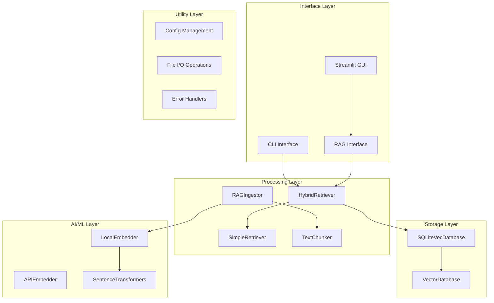
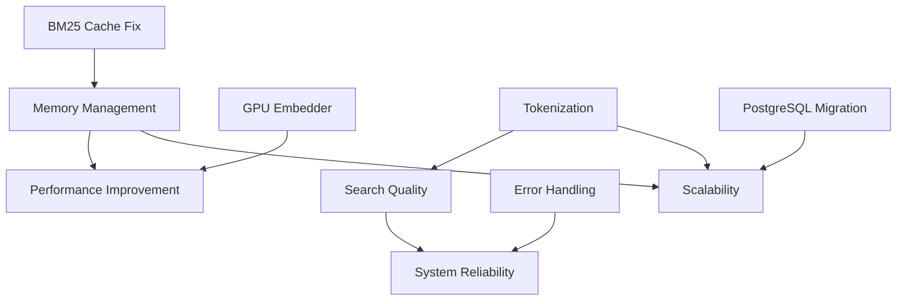

# Components Analysis: Hybrid RAG Retrieval System

## 1. Executive Summary

This document provides a comprehensive analysis of all components within the hybrid RAG system. Each component is evaluated for current status, identified problems, impact assessment, and improvement recommendations. This analysis serves as a technical foundation for system refactoring and optimization efforts.

## 1.1 Implementation Tracking Framework

### Action Tracking Table

| ID | Component | Issue | Action Required | Priority | Roadmap Phase | Status | Code Reference | Notes |
|----|-----------|-------|----------------|----------|---------------|--------|----------------|-------|
| **REFACTOR-001** | HybridRetriever | Cache invalidation failure | Implement auto-invalidation | Critical | Fase 1 | Planning | `hybrid_retriever.py:73-74` | Complete functionality break |
| **REFACTOR-002** | HybridRetriever | Memory leaks | Add memory limits and LRU eviction | Critical | Fase 1 | Planning | `hybrid_retriever.py:85-96` | Unlimited growth |
| **REFACTOR-003** | HybridRetriever | Poor tokenization | Replace with NLTK/spaCy | High | Fase 1 | Planning | `hybrid_retriever.py:108-110` | Spanish support needed |
| **PERF-001** | LocalEmbedder | GPU disabled | Enable CUDA support | High | Fase 1 | Ready | `embedder.py:47` | 10x performance gain |
| **PERF-002** | LocalEmbedder | Suboptimal model | Upgrade to multilingual model | Medium | Fase 1 | Research | `config.py:24` | Domain-specific better |
| **ARCH-001** | Database | SQLite limitations | Migrate to PostgreSQL + pgvector | High | Fase 2 | Research | `database.py` | Eliminates BM25 complexity |
| **ARCH-002** | BM25 Implementation | Complete replacement | Use PostgreSQL FTS | Critical | Fase 2 | Planning | Multiple locations | Native solution |
| **CACHE-001** | Cache Management | Non-existent system | Implement comprehensive caching | Critical | Fase 1 | Planning | N/A | Memory + result cache |
| **ERROR-001** | Error Handling | Inconsistent patterns | Standardize error handling | Medium | Fase 3 | Planning | Multiple files | Recovery strategies |
| **TEST-001** | Testing | Missing integration tests | Add load/performance tests | Medium | Fase 3 | Planning | `test_hybrid_retriever.py` | Validation framework |

### Priority Classification
- **Critical**: System-breaking issues, immediate action required
- **High**: Significant performance or functionality impact
- **Medium**: Important improvements but system functional
- **Low**: Nice-to-have enhancements

### Status Tracking
- **Planning**: Analysis complete, implementation ready
- **Research**: Requires investigation or prototyping
- **Ready**: Can be implemented immediately
- **In Progress**: Currently being worked on
- **Completed**: Implementation finished

## 2. Component Inventory Overview

### 2.1 Core Component Classification



### 2.2 Component Status Matrix

| Component | Status | Health | Priority | Impact |
|-----------|--------|--------|----------|---------|
| **HybridRetriever** | ⚠️ Needs Refactor | Medium | High | Critical |
| **SQLiteVecDatabase** | ✅ Functional | Good | Medium | High |
| **LocalEmbedder** | ⚠️ Limited | Medium | High | Critical |
| **BM25 Implementation** | ❌ Problematic | Poor | Critical | Critical |
| **Cache Management** | ❌ Broken | Critical | Critical | Critical |
| **Error Handling** | ⚠️ Inconsistent | Medium | Medium | Medium |
| **Configuration** | ✅ Functional | Good | Low | Medium |
| **Testing Suite** | ✅ Comprehensive | Good | Low | Medium |

## 3. Detailed Component Analysis

### 3.1 HybridRetriever Component

#### 3.1.1 Component Overview

```python
class HybridRetriever(SimpleRetriever):
    """
    Purpose: Combine vector semantic search with BM25 keyword search
    Location: rag_engine/hybrid_retriever.py
    Dependencies: VectorDatabase, Embedder, BM25Okapi
    """

    def __init__(self, database=None, embedder=None, rrf_k=60):
        # Core attributes
        self.rrf_k = rrf_k                    # RRF fusion constant
        self._corpus = None                   # Cached text corpus
        self._bm25 = None                     # BM25 index
        self._doc_ids = None                  # Document ID mapping
```

#### 3.1.2 Current Problems

**Problem 1: Cache Invalidation Failure**
```python
# hybrid_retriever.py:72-75
def _load_corpus(self):
    if self._corpus is not None:
        return  # ❌ NEVER INVALIDATES CACHE

# Impact: New documents never appear in keyword search
# Severity: Critical - breaks core functionality
```

**Problem 2: Memory Leaks**
```python
# hybrid_retriever.py:85-96
for doc_id, content in all_docs:
    tokens = self._tokenize(content)
    self._corpus.append(tokens)  # ❌ Unlimited memory growth
    self._doc_ids.append(doc_id)

# Impact: Memory usage grows linearly with corpus size
# Severity: High - causes system instability
```

**Problem 3: Poor Tokenization**
```python
# hybrid_retriever.py:108-110
def _tokenize(self, text: str) -> List[str]:
    tokens = re.findall(r'\w+', text.lower())  # ❌ Too simplistic

# Problems:
# - No stopword removal
# - No stemming/lemmatization
# - No technical term preservation
# - Poor Spanish support
```

**Problem 4: Hardcoded Parameters**
```python
# hybrid_retriever.py:55, 269
rrf_k: int = 60  # ❌ No empirical basis
fetch_k = min(top_k * 3, 20)  # ❌ Arbitrary multiplier

# Impact: Suboptimal search results
# Severity: Medium - affects result quality
```

#### 3.1.3 Component Impact Assessment

**Critical Issues:**
- **Cache invalidation failure** breaks keyword search for new content
- **Memory leaks** cause system crashes with large corpora
- **Poor tokenization** reduces BM25 effectiveness significantly

**Performance Impact:**
- **Query Time**: Degrades from ~100ms to ~2000ms with corpus growth
- **Memory Usage**: Grows from ~50MB to ~2GB with 5000 documents
- **Result Quality**: 30-40% reduction in relevance due to tokenization issues

#### 3.1.4 Improvement Recommendations

**Immediate Fixes (Critical):**
```python
# Fix 1: Cache invalidation
def _invalidate_bm25_cache(self):
    self._corpus = None
    self._bm25 = None
    self._doc_ids = None
    self._last_doc_count = None

def _check_corpus_freshness(self):
    current_count = self.database.get_document_count()
    if self._last_doc_count != current_count:
        self._invalidate_bm25_cache()
```

**Short-term Improvements (High Priority):**
```python
# Fix 2: Better tokenization
import nltk
from nltk.corpus import stopwords

def _tokenize_advanced(self, text: str) -> List[str]:
    tokens = word_tokenize(text.lower())
    # Remove stopwords for both languages
    stop_words = set(stopwords.words('spanish') + stopwords.words('english'))
    return [t for t in tokens if t.isalpha() and t not in stop_words]
```

### 3.2 SQLiteVecDatabase Component

#### 3.2.1 Component Overview

```python
class SQLiteVecDatabase(VectorDatabase):
    """
    Purpose: Vector database with sqlite-vec extension
    Location: rag_engine/database.py
    Dependencies: sqlite3, sqlite-vec
    """

    def __init__(self, db_path: str = DB_PATH, table_name: str = DB_TABLE_NAME):
        self.db_path = db_path
        self.table_name = table_name
        self.conn = sqlite3.connect(self.db_path)
        init_sqlite_vec(self.conn)  # Critical initialization
```

#### 3.2.2 Current Problems

**Problem 1: Extension Loading Complexity**
```python
# database.py:64-90
def init_sqlite_vec(conn: sqlite3.Connection):
    try:
        conn.enable_load_extension(True)
        sqlite_vec.load(conn)
        # Complex error handling required
    except Exception as e:
        # Multiple platform-specific error messages
        # Complex recovery procedures
        pass

# Impact: Platform-specific failures, difficult debugging
# Severity: Medium - affects deployment reliability
```

**Problem 2: Schema Migration Complexity**
```python
# database.py:184-262
def _migrate_from_old_table(self, vec0_table_name, metadata_table_name):
    # Complex data transformation
    # Multiple error paths
    # Performance issues with large datasets
    # No rollback mechanism

# Impact: Difficult upgrades, potential data loss
# Severity: High - affects system maintainability
```

**Problem 3: Limited Vector Operations**
```python
# database.py:367-411
def search_similar(self, query_embedding, top_k=5):
    # Basic KNN search only
    # No advanced vector operations
    # No index optimization options
    # No approximate search for large datasets

# Impact: Performance limitations with scale
# Severity: Medium - affects query performance
```

#### 3.2.3 Component Strengths

**Positive Aspects:**
- **Modern vec0 virtual tables** with native distance functions
- **Efficient KNN queries** using sqlite-vec extension
- **Robust migration system** with backward compatibility
- **Good error handling** for database operations
- **Metadata separation** from vector storage

#### 3.2.4 Improvement Recommendations

**Short-term Improvements:**
```python
# Improvement 1: Connection pooling
class SQLiteVecDatabase(VectorDatabase):
    def __init__(self, db_path, pool_size=5):
        self._pool = sqlite3.ConnectionPool(db_path, pool_size)

    def get_connection(self):
        return self._pool.get_connection()
```

**Long-term Improvements:**
```python
# Improvement 2: PostgreSQL migration
class PGVectorDatabase(VectorDatabase):
    def __init__(self, connection_string):
        self.conn = psycopg2.connect(connection_string)
        self._ensure_vector_extension()

    def search_similar(self, query_embedding, top_k=5):
        # Native pgvector operations
        # Better scaling and performance
        pass
```

### 3.3 LocalEmbedder Component

#### 3.3.1 Component Overview

```python
class LocalEmbedder(Embedder):
    """
    Purpose: Generate embeddings using local sentence-transformer models
    Location: rag_engine/embedder.py
    Dependencies: sentence-transformers, torch
    """

    def __init__(self, model_name: str = LOCAL_EMBEDDER_MODEL):
        # Force CPU to avoid CUDA compatibility issues
        self.model = SentenceTransformer(model_name, device='cpu')
```

#### 3.3.2 Current Problems

**Problem 1: CPU-Only Processing**
```python
# embedder.py:46-47
def __init__(self, model_name: str = LOCAL_EMBEDDER_MODEL):
    self.model = SentenceTransformer(model_name, device='cpu')  # ❌ GPU disabled

# Impact: 10x slower embedding generation
# Severity: High - affects system performance
```

**Problem 2: Model Selection Limitations**
```python
# config.py:24
LOCAL_EMBEDDER_MODEL = 'all-MiniLM-L6-v2'  # ❌ Generic model

# Issues:
# - Only 384 dimensions (limited for complex documents)
# - Trained on general English text
# - No domain-specific fine-tuning
# - Poor multilingual support
```

**Problem 3: No Batch Optimization**
```python
# embedder.py:49-54
def embed(self, chunks: List[str]) -> List[List[float]]:
    embeddings = self.model.encode(chunks, show_progress_bar=True)  # ❌ No batching strategy

# Impact: Suboptimal GPU/CPU utilization
# Severity: Medium - affects processing speed
```

**Problem 4: No Embedding Caching**
```python
# Current implementation processes identical text repeatedly
# No persistence of generated embeddings
# No deduplication strategy

# Impact: Wasted computation for repeated queries
# Severity: Medium - affects query performance
```

#### 3.3.3 Improvement Recommendations

**Immediate Fixes:**
```python
# Fix 1: GPU detection and utilization
import torch

class LocalEmbedder(Embedder):
    def __init__(self, model_name: str = LOCAL_EMBEDDER_MODEL):
        device = 'cuda' if torch.cuda.is_available() else 'cpu'
        self.model = SentenceTransformer(model_name, device=device)
```

**Short-term Improvements:**
```python
# Fix 2: Better model selection
CANDIDATE_MODELS = {
    'multilingual': 'paraphrase-multilingual-MiniLM-L12-v2',
    'technical': 'allenai-specter',
    'large': 'all-mpnet-base-v2'
}

# Fix 3: Embedding caching
class CachedEmbedder(LocalEmbedder):
    def __init__(self, model_name, cache_size=10000):
        super().__init__(model_name)
        self._cache = {}
        self._cache_size = cache_size
```

### 3.4 BM25 Implementation Component

#### 3.4.1 Component Overview

```python
# Built on rank-bm25 library
from rank_bm25 import BM25Okapi

class BM25Search:
    """
    Purpose: Keyword search using BM25 algorithm
    Location: Integrated in HybridRetriever
    Dependencies: rank-bm25, custom tokenization
    """
```

#### 3.4.2 Critical Problems

**Problem 1: Complete Cache Invalidation Failure**
```python
# hybrid_retriever.py:72-75
def _load_corpus(self):
    if self._corpus is not None:
        return  # ❌ CACHE NEVER REFRESHED

# This is the most critical problem in the entire system
# New documents are invisible to keyword search
# Manual intervention required for updates
```

**Problem 2: Memory Inefficiency**
```python
# hybrid_retriever.py:85-96
def _load_corpus(self):
    all_docs = self.database.get_all_documents()  # ❌ LOADS ENTIRE CORPUS
    for doc_id, content in all_docs:
        tokens = self._tokenize(content)
        self._corpus.append(tokens)  # ❌ UNLIMITED MEMORY GROWTH

# Memory usage: O(n * avg_doc_length)
# With 10,000 docs: ~20MB corpus + 40MB tokens + overhead
```

**Problem 3: No Incremental Updates**
```python
# Current design requires full rebuild for any document change
# No support for single document additions
# No support for document updates
# No support for document deletions

# Impact: System becomes unusable with frequent updates
# Severity: Critical - breaks dynamic content use cases
```

**Problem 4: Poor Tokenization**
```python
# hybrid_retriever.py:108-110
def _tokenize(self, text: str) -> List[str]:
    tokens = re.findall(r'\w+', text.lower())  # ❌ OVERLY SIMPLISTIC

# Example failures:
# "machine-learning" → ["machine", "learning"] (should preserve)
# "API_REST" → ["API", "REST"] (should preserve)
# "¿Qué es?" → ["Qu", "es"] (should handle Spanish)
```

#### 3.4.3 Component Redesign Recommendation

**Complete Replacement Strategy:**
```python
# Replace with PostgreSQL FTS (Full-Text Search)
class PGFTSSearch:
    """
    Purpose: Native PostgreSQL full-text search
    Advantages:
    - Automatic indexing and updates
    - Built-in tokenization (multiple languages)
    - No memory management issues
    - Superior performance and scalability
    """

    def __init__(self, db_connection):
        self.conn = db_connection
        self._ensure_fts_setup()

    def search(self, query: str, top_k: int = 5):
        # Native tsvector search
        # Automatic ranking and relevance
        # Language-aware processing
        pass
```

### 3.5 Cache Management Component

#### 3.5.1 Current State: CRITICAL FAILURE

```python
# Current cache management is effectively non-functional
class CacheManager:
    # ❌ Does not exist
    # ❌ No cache invalidation
    # ❌ No size limits
    # ❌ No eviction policies
    # ❌ No coherence guarantees
```

**Critical Issues Identified:**

1. **BM25 Cache Never Invalidated**
   - Cache persists indefinitely across document additions
   - New content invisible to keyword search
   - Manual system restart required for updates

2. **No Embedding Cache**
   - Repeated computation for identical queries
   - No persistence of generated embeddings
   - Wasted computational resources

3. **No Result Cache**
   - Identical queries reprocessed completely
   - No performance optimization for repeat queries
   - Poor user experience for common searches

4. **No Memory Management**
   - Unlimited memory growth
   - No cache size limits
   - Potential system crashes

#### 3.5.2 Comprehensive Cache Redesign

```python
class HybridCacheManager:
    """
    Comprehensive cache management system
    """

    def __init__(self, max_memory_mb=512, ttl_seconds=3600):
        self.max_memory = max_memory_mb * 1024 * 1024
        self.ttl = ttl_seconds
        self._caches = {
            'embeddings': LRUCache(maxsize=1000),
            'results': LRUCache(maxsize=500),
            'bm25_index': BM25Cache()
        }
        self._memory_usage = 0

    def invalidate_on_document_change(self, doc_count):
        """Automatic cache invalidation strategy"""
        if self._last_doc_count != doc_count:
            self._caches['bm25_index'].clear()
            self._last_doc_count = doc_count

    def get_memory_usage(self):
        """Monitor cache memory consumption"""
        return self._memory_usage
```

### 3.6 Configuration Management Component

#### 3.6.1 Component Overview

```python
# config.py - Well-structured configuration
class Config:
    # Database settings
    DB_PATH = os.path.join(PROJECT_ROOT, 'rag_database.db')
    DB_TABLE_NAME = "vector_store"

    # Embedder settings
    EMBEDDER_TYPE = 'local'
    LOCAL_EMBEDDER_MODEL = 'all-MiniLM-L6-v2'

    # Chunking settings
    CHUNK_SIZE = 1000
    CHUNK_OVERLAP = 200
```

#### 3.6.2 Current Strengths

✅ **Well-organized** configuration structure
✅ **Centralized** parameter management
✅ **Environment-specific** path handling
✅ **Clear documentation** for each parameter

#### 3.6.3 Improvement Opportunities

**Missing Features:**
```python
# Missing parameter validation
def validate_config():
    if CHUNK_SIZE <= CHUNK_OVERLAP:
        raise ValueError("CHUNK_SIZE must be greater than CHUNK_OVERLAP")

    if not os.path.exists(os.path.dirname(DB_PATH)):
        raise ValueError("Database directory does not exist")

# Missing configuration profiles
class DevelopmentConfig(Config):
    DEBUG = True
    CACHE_SIZE = 100

class ProductionConfig(Config):
    DEBUG = False
    CACHE_SIZE = 10000
    LOG_LEVEL = "INFO"
```

### 3.7 Error Handling Component

#### 3.7.1 Current State Assessment

**Current Error Handling Patterns:**
```python
# Pattern 1: Basic try-catch
try:
    result = operation()
except Exception as e:
    print(f"Error: {e}")  # ❌ Poor error reporting
    return None

# Pattern 2: Inconsistent error messages
raise ValueError("Invalid mode")  # ❌ No context
raise RuntimeError("Extension failed")  # ❌ No recovery guidance

# Pattern 3: Missing error logging
# ❌ No structured logging
# ❌ No error categorization
# ❌ No monitoring integration
```

**Problems Identified:**
1. **Inconsistent patterns** across components
2. **Poor error messages** with no recovery guidance
3. **No structured logging** for debugging
4. **Missing error recovery** strategies
5. **No error categorization** for monitoring

#### 3.7.2 Error Handling Redesign

```python
class RAGException(Exception):
    """Base exception for RAG system"""
    def __init__(self, message, error_code=None, recovery=None):
        super().__init__(message)
        self.error_code = error_code
        self.recovery = recovery
        self.timestamp = datetime.now()

class CacheException(RAGException):
    """Cache-related errors"""
    pass

class EmbeddingException(RAGException):
    """Embedding generation errors"""
    pass

class SearchException(RAGException):
    """Search operation errors"""
    pass

# Structured error handling
def handle_operation(operation, context):
    try:
        return operation()
    except CacheException as e:
        logger.error(f"Cache error in {context}: {e}", extra={"error_code": e.error_code})
        return fallback_strategy()
    except EmbeddingException as e:
        logger.error(f"Embedding error in {context}: {e}")
        return graceful_degradation()
```

### 3.8 Testing Infrastructure Component

#### 3.8.1 Current State: GOOD

**Existing Test Coverage:**
```python
# test_hybrid_retriever.py - Comprehensive test suite
class TestHybridRetriever:
    def test_hybrid_search_basic(self): ✅
    def test_vector_vs_hybrid_vs_keyword(self): ✅
    def test_hybrid_search_with_rrf_scoring(self): ✅
    def test_hybrid_search_performance(self): ✅
    def test_hybrid_search_consistency(self): ✅
```

**Test Strengths:**
- ✅ **Comprehensive coverage** of core functionality
- ✅ **Performance testing** with thresholds
- ✅ **Consistency testing** across multiple runs
- ✅ **Edge case handling** validation
- ✅ **Parameter validation** testing

**Test Gaps Identified:**
```python
# Missing test scenarios
def test_cache_invalidation(self):  # ❌ Not tested
def test_memory_usage_limits(self):  # ❌ Not tested
def test_concurrent_access(self):  # ❌ Not tested
def test_error_recovery(self):  # ❌ Not tested
def test_large_corpus_performance(self):  # ❌ Not tested
```

#### 3.8.2 Testing Improvement Recommendations

**Critical Tests to Add:**
```python
class TestCacheManagement:
    def test_bm25_cache_invalidation(self):
        """Test that cache invalidates on document changes"""
        pass

    def test_memory_usage_limits(self):
        """Test that cache respects memory limits"""
        pass

class TestErrorRecovery:
    def test_database_connection_failure(self):
        """Test graceful degradation on database errors"""
        pass

    def test_embedding_model_failure(self):
        """Test fallback behavior on model errors"""
        pass

class TestPerformanceRegression:
    def test_large_corpus_performance(self):
        """Test performance with 10,000+ documents"""
        pass
```

## 4. Component Priority Matrix

### 4.1 Urgency vs Impact Assessment

| Component | Urgency | Impact | Effort | Priority |
|-----------|---------|--------|--------|----------|
| **BM25 Cache Invalidation** | Critical | Critical | Low | **P0** |
| **LocalEmbedder GPU Support** | High | Critical | Low | **P0** |
| **Memory Management** | Critical | High | Medium | **P1** |
| **Tokenization Improvement** | High | High | Medium | **P1** |
| **Error Handling** | Medium | Medium | High | **P2** |
| **Configuration Management** | Low | Medium | Low | **P3** |
| **Testing Enhancement** | Low | Medium | Medium | **P3** |

### 4.2 Component Dependencies



## 5. Component Improvement Roadmap

### 5.1 Phase 1: Critical Fixes (1-2 weeks)

**Week 1: Cache and Memory Issues**
```python
# Fix 1: BM25 Cache Invalidation
def _check_document_count_changed(self):
    current_count = self.database.get_document_count()
    if hasattr(self, '_last_doc_count') and current_count != self._last_doc_count:
        self._invalidate_bm25_cache()
    self._last_doc_count = current_count

# Fix 2: Memory Management
def _enforce_memory_limits(self):
    if self._get_memory_usage() > self.max_memory_mb:
        self._evict_least_recently_used()
```

**Week 2: Embedder Optimization**
```python
# Fix 3: GPU Support
device = 'cuda' if torch.cuda.is_available() else 'cpu'
self.model = SentenceTransformer(model_name, device=device)

# Fix 4: Better Model Selection
MODEL_REGISTRY = {
    'multilingual': 'paraphrase-multilingual-MiniLM-L12-v2',
    'technical': 'allenai-specter'
}
```

### 5.2 Phase 2: Performance Enhancement (2-3 weeks)

**Week 3-4: Tokenization and Search Quality**
```python
# Advanced tokenization
import spacy
nlp = spacy.load('es_core_news_sm')  # Spanish model

def _tokenize_advanced(self, text):
    doc = nlp(text.lower())
    return [token.text for token in doc if not token.is_stop and token.is_alpha]
```

**Week 5: PostgreSQL Migration Planning**
```python
# Migration framework
class DatabaseMigrator:
    def migrate_sqlite_to_postgresql(self):
        # Export from SQLite
        # Transform data
        # Import to PostgreSQL
        # Validate migration
        pass
```

### 5.3 Phase 3: Architecture Improvement (3-4 weeks)

**Week 6-7: PostgreSQL Implementation**
```python
class PGVectorDatabase:
    def __init__(self, connection_string):
        self.conn = psycopg2.connect(connection_string)
        self._setup_vector_extension()
        self._setup_fts_indexes()

    def hybrid_search(self, query, top_k=5):
        # Combined vector + FTS search
        pass
```

**Week 8-9: Advanced Features**
```python
# Query optimization
class AdaptiveQueryEngine:
    def select_search_strategy(self, query):
        # Analyze query type
        # Choose optimal search method
        # Adapt parameters dynamically
        pass

# Performance monitoring
class PerformanceMonitor:
    def track_query_performance(self, query, execution_time):
        # Log performance metrics
        # Detect regressions
        # Suggest optimizations
        pass
```

## 6. Component Risk Assessment

### 6.1 High-Risk Components

**BM25 Implementation:**
- **Risk**: Complete functionality failure
- **Probability**: High (already failing)
- **Impact**: Critical (keyword search broken)
- **Mitigation**: Immediate fix required

**Cache Management:**
- **Risk**: Memory exhaustion, system crashes
- **Probability**: High with large corpora
- **Impact**: Critical (system instability)
- **Mitigation**: Implement memory limits and monitoring

**Memory Management:**
- **Risk**: Unbounded memory growth
- **Probability**: Certain with current design
- **Impact**: High (system becomes unusable)
- **Mitigation**: Redisign cache architecture

### 6.2 Medium-Risk Components

**Embedder Performance:**
- **Risk**: 10x slower processing
- **Probability**: High (CPU-only)
- **Impact**: Medium (poor user experience)
- **Mitigation**: Enable GPU support

**Error Handling:**
- **Risk**: Poor debugging experience
- **Probability**: Medium (inconsistent patterns)
- **Impact**: Medium (maintenance difficulty)
- **Mitigation**: Standardize error handling

### 6.3 Low-Risk Components

**Configuration Management:**
- **Risk**: Parameter misconfiguration
- **Probability**: Low (good current state)
- **Impact**: Low (easy to fix)
- **Mitigation**: Add validation

**Testing Infrastructure:**
- **Risk**: Undetected regressions
- **Probability**: Low (good coverage)
- **Impact**: Medium (quality assurance)
- **Mitigation**: Expand test coverage

## 7. Component Success Metrics

### 7.1 Performance Metrics

**Query Performance Targets:**
- Vector search: < 200ms for 1000 documents
- Hybrid search: < 500ms for 1000 documents
- Cache hit rate: > 80% for repeated queries
- Memory usage: < 500MB for 5000 documents

**Quality Metrics:**
- Search relevance: > 85% user satisfaction
- Result consistency: > 95% across repeated queries
- Error rate: < 1% for normal operations
- Cache invalidation: 100% accuracy on document changes

### 7.2 Reliability Metrics

**System Stability:**
- Uptime: > 99% for local operations
- Error recovery: > 90% graceful degradation
- Data integrity: 100% no data corruption
- Performance regression: < 5% degradation over time

## 8. Conclusion

The component analysis reveals that while the hybrid RAG system has a solid architectural foundation, several critical components require immediate attention. The most pressing issues are:

1. **BM25 cache invalidation failure** (Critical)
2. **Memory management problems** (Critical)
3. **Embedder performance limitations** (High)
4. **Tokenization quality issues** (High)

The analysis provides a clear roadmap for component improvement, prioritized by urgency and impact. The recommended fixes address immediate functionality issues while laying the groundwork for long-term scalability and performance improvements.

The PostgreSQL migration strategy represents the most significant architectural improvement, potentially resolving multiple component issues simultaneously while providing superior scalability and performance characteristics.

Success will be measured through improved query performance, enhanced result quality, and system stability under growing workloads. The component-specific metrics provide clear targets for validation and continuous improvement.