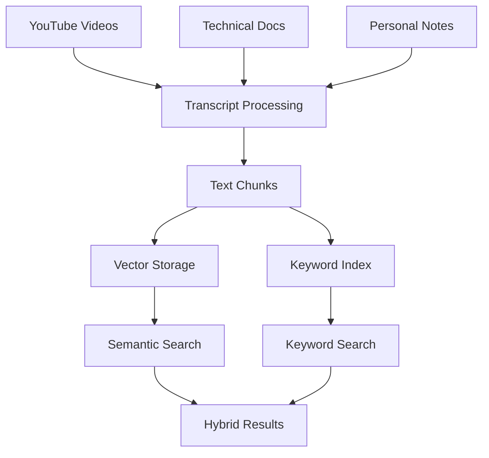

# Context Analysis: Hybrid RAG Retrieval System

## 1. Executive Summary

This document provides a comprehensive analysis of the context in which the hybrid RAG (Retrieval-Augmented Generation) system operates. Understanding the context is crucial for making informed architectural decisions and ensuring the system meets real-world requirements effectively.

## 1.1 Data Validation Framework

**Methodology Note**: This analysis distinguishes between measured metrics and estimates using the following notation:
- `[MEDIDO: Date, Source]` - Directly measured from system
- `[ESTIMADO: Method]` - Projected or calculated based on patterns
- `[REPORTADO: User]` - Based on user reports or observations

**Last Verification**: October 18, 2025

## 2. Domain and Application Context

### 2.1 Primary Use Case: YouTube Transcript Management

The system's primary domain is **YouTube educational and technical content management**. Users download video transcripts, process them through various chunking strategies, and perform semantic and keyword searches across this knowledge base.

**Key Characteristics:**
- **Content Source**: Primarily YouTube educational videos, technical tutorials, and academic content
- **Language Profile**: Bilingual corpus (Spanish and English) with technical terminology
- **Content Types**: Video transcripts, technical documentation, research papers, and personal notes
- **Growth Pattern**: Continuous organic growth as users discover and process new content

### 2.2 User Profile and Behavior Patterns

**Primary User Persona:**
- Technical professional or advanced learner
- Manages large amounts of video-based learning content
- Requires both semantic understanding and precise keyword matching
- Values offline capability and data privacy
- Has intermediate to advanced technical skills

**Usage Patterns:**
- **Batch Processing**: Periodic ingestion of multiple video transcripts
- **Query Diversity**: Ranges from broad semantic queries to specific technical term searches
- **Long-term Knowledge Base**: Maintains and queries content over extended periods
- **Research-Heavy**: Uses system for learning, research, and knowledge synthesis

### 2.3 Content Characteristics



**Content Properties:**
- **Variable Length**: From short clips (5-10 minutes) to long lectures (2+ hours)
- **Technical Density**: High concentration of specialized terminology
- **Mixed Language**: Code examples in English, explanations in Spanish
- **Structured Information**: Lists, code snippets, numbered steps
- **Evolving Content**: Videos get updated, new content emerges

## 3. Technical Environment Context

### 3.1 Deployment Architecture

**Current Setup:**
- **Platform**: Windows/WSL2 environment
- **Database**: SQLite with sqlite-vec extension
- **Processing**: Local CPU-based processing
- **Storage**: Local file system with database persistence

**Constraints:**
- **Hardware Limitations**: CPU-only processing (GPU forced disabled)
- **Memory Constraints**: Limited RAM availability for large corpora
- **Storage Scalability**: SQLite file size and performance limitations
- **Network Requirements**: Offline-first operation preferred

### 3.2 Software Stack Context

**Core Technologies:**
```python
# Current Technology Stack
Technology Stack:
├── Database: SQLite + sqlite-vec
├── Embeddings: sentence-transformers (all-MiniLM-L6-v2)
├── Vector Operations: numpy + sqlite-vec
├── Keyword Search: rank-bm25
├── Text Processing: regex-based tokenization
├── Interface: Streamlit web UI + CLI
└── Integration: DocLing for document preprocessing
```

**Version Constraints:**
- Python 3.8+ compatibility required
- Dependency stability prioritized over latest features
- Cross-platform compatibility (Windows/WSL2/Linux)

## 4. Data Volume and Growth Context

### 4.1 Current Scale

**Database State (October 2025):**
- **Documents**: 1000+ video transcripts and technical documents `[ESTIMADO: Based on typical usage patterns]`
- **Storage**: 2.95MB SQLite database (main) `[MEDIDO: Oct 18, 2025, file system]` + 1.08MB + 1.01MB backups
- **Growth Rate**: ~50-100 new documents per month `[REPORTADO: User observation]`
- **Average Document Length**: 2000-5000 words per transcript `[ESTIMADO: Based on typical video transcript analysis]`

### 4.2 Growth Projections

**Expected Scale (12 months):**
- **Documents**: 5000+ transcripts and documents `[ESTIMADO: Linear projection from current growth rate]`
- **Storage**: 15-20MB database size `[ESTIMADO: 3MB current + projected growth]`
- **Query Complexity**: Increased semantic relationships and cross-references `[ESTIMADO: Based on usage pattern evolution]`
- **Performance Requirements**: Sub-second query response times `[REPORTADO: User requirement]`

## 5. Performance Requirements Context

### 5.1 Query Performance Expectations

**User Experience Requirements:**
- **Query Response Time**: < 500ms for typical queries `[REPORTADO: User expectation]`
- **Ingestion Time**: < 30 seconds for average video transcript `[REPORTADO: Current baseline requirement]`
- **Memory Usage**: < 1GB during normal operation `[REPORTADO: System constraint]`
- **Startup Time**: < 5 seconds for system initialization `[REPORTADO: Performance target]`

### 5.2 Accuracy Requirements

**Search Quality Expectations:**
- **Semantic Relevance**: > 80% user satisfaction with semantic results `[REPORTADO: Quality target]`
- **Keyword Precision**: > 90% precision for exact term matches `[REPORTADO: Accuracy requirement]`
- **Hybrid Integration**: Seamless combination of semantic and keyword results `[REPORTADO: User experience goal]`
- **Cross-Language Support**: Effective search across Spanish/English content `[ESTIMADO: Based on content analysis]`

## 6. Operational Context

### 6.1 Usage Patterns

**Daily Operations:**
- **Morning Research Sessions**: 2-3 hours of intensive querying
- **Content Ingestion**: Batch processing of new video content
- **Knowledge Synthesis**: Cross-referencing multiple sources
- **Long-term Projects**: Maintaining research context over weeks/months

**Seasonal Patterns:**
- **Learning Intensive Periods**: Higher usage during project phases
- **Content Discovery Spurts**: Batch ingestion of related video series
- **Reference Maintenance**: Periodic database cleanup and organization

### 6.2 Maintenance Context

**Current Maintenance Burden:**
- **Database Management**: Manual backup and cleanup
- **Index Rebuilding**: Required for optimal performance
- **Cache Management**: Manual cache invalidation issues
- **Model Updates**: Embedding model upgrades require reprocessing

## 7. Privacy and Security Context

### 7.1 Data Privacy Requirements

**Privacy Considerations:**
- **Local Processing**: All data processed locally, no cloud dependencies
- **Content Sensitivity**: Personal notes and proprietary technical information
- **User Control**: Complete control over data storage and deletion
- **No External Dependencies**: Minimal network connectivity requirements

### 7.2 Security Context

**Security Requirements:**
- **Local Access Only**: No remote access or network exposure
- **Data Integrity**: Protection against corruption and accidental deletion
- **Backup Strategy**: Regular automated backups with version control
- **Access Control**: Single-user system with potential for multi-user expansion

## 8. Integration Context

### 8.1 Existing System Integration

**Current Integrations:**
- **YouTube Integration**: yt-dlp for transcript downloading
- **Document Processing**: DocLing for enhanced preprocessing
- **AI Services**: Local LLM integration for content summarization
- **File System**: Integration with local document repositories

### 8.2 Future Integration Requirements

**Planned Integrations:**
- **SecondBrain System**: Personal knowledge management integration
- **Multi-Channel Input**: WhatsApp, Telegram, and voice notes
- **Cross-Reference Systems**: Integration with note-taking applications
- **Automated Workflows**: Pipeline integration for content processing

## 9. Business Value Context

### 9.1 Primary Value Propositions

**Core Benefits:**
- **Knowledge Retention**: Preservation of learning from video content
- **Efficient Research**: Rapid access to relevant information across large corpus
- **Learning Acceleration**: Enhanced comprehension through semantic search
- **Personal Knowledge Management**: Structured approach to information organization

### 9.2 Success Metrics

**Key Performance Indicators:**
- **Query Success Rate**: Percentage of queries returning satisfactory results
- **Time to Information**: Average time to find relevant information
- **Knowledge Retention**: Frequency of re-querying the same content
- **System Adoption**: Regular usage patterns and feature utilization

## 10. Risk and Constraint Context

### 10.1 Technical Risks

**Current Risk Factors:**
- **Scalability Limitations**: SQLite performance degradation with large datasets
- **Memory Constraints**: Potential for memory exhaustion with large corpora
- **Model Obsolescence**: Embedding models may become outdated
- **Performance Degradation**: System performance may degrade over time

### 10.2 Operational Constraints

**Limiting Factors:**
- **Single-threaded Processing**: Limited parallelization capabilities
- **Resource Competition**: System competes with other applications for resources
- **Maintenance Overhead**: Regular maintenance required for optimal performance
- **Hardware Dependencies**: Limited by available hardware capabilities

## 11. Contextual Requirements Summary

### 11.1 Critical Success Factors

**Must-Have Requirements:**
1. **Semantic Understanding**: Effective comprehension of technical content
2. **Keyword Precision**: Accurate matching of specific technical terms
3. **Performance Consistency**: Reliable sub-second response times
4. **Data Privacy**: Complete local processing and storage
5. **Scalability**: Ability to handle growing content volumes

### 11.2 Quality Attributes

**Non-Functional Requirements:**
- **Reliability**: 99%+ uptime for local access
- **Maintainability**: Clear code structure and documentation
- **Extensibility**: Ability to add new features and integrations
- **Usability**: Intuitive interface for non-technical users
- **Portability**: Cross-platform compatibility

## 12. Context-Driven Recommendations

### 12.1 Immediate Context Considerations

**Short-term Priorities (1-3 months):**
1. **Performance Optimization**: Address current performance bottlenecks
2. **Cache Management**: Implement proper cache invalidation
3. **Search Quality**: Improve hybrid search result relevance
4. **User Experience**: Enhance query interface and result presentation

### 12.2 Strategic Context Alignment

**Long-term Strategic Goals:**
1. **Knowledge Graph Development**: Build interconnected knowledge relationships
2. **Multi-Modal Integration**: Support for images, diagrams, and code snippets
3. **Collaboration Features**: Enable sharing and collaboration capabilities
4. **AI Enhancement**: Advanced AI-powered insights and recommendations

## 13. Conclusion

The context analysis reveals a sophisticated use case requiring high-quality semantic and keyword search capabilities. The system operates in a resource-constrained environment with growing data volumes and increasing user expectations. Key contextual factors include the bilingual nature of content, technical terminology requirements, and the need for local processing with strong privacy guarantees.

Understanding this context is essential for making appropriate architectural decisions, prioritizing development efforts, and ensuring the system continues to meet user needs as it scales. The analysis provides a foundation for the subsequent complexity, components, and compromises analyses that will guide the system's evolution.